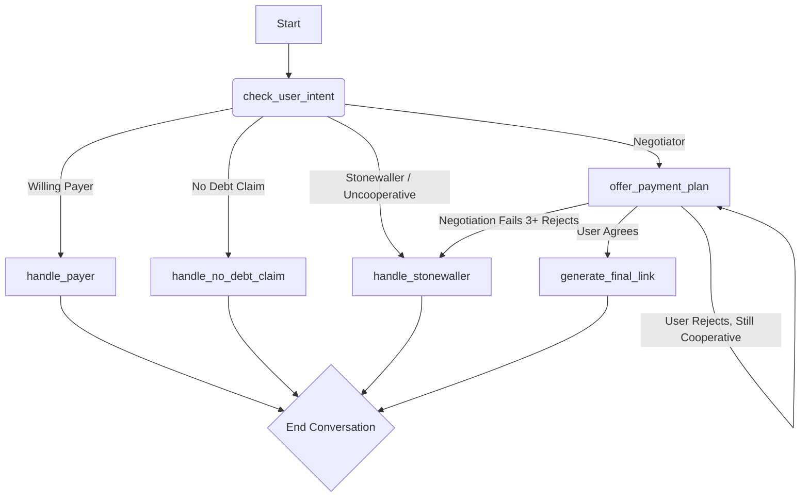

# CollectWise Technical Take-Home Assignment Product Requirements Document (PRD) - V1.2

## Goals and Background Context

### Goals

- To build an AI agent that intelligently negotiates a **reasonable and realistic payment plan**.
- To implement a **stateful, multi-path negotiation strategy** that can handle various user personas and tricky situations like debt denial.
- To provide a **simple and professional desktop-first chat UI** using the `@nlux/react` library.
- To ensure the chat history **persists in a server-side JSON file**.
- To successfully deploy the decoupled frontend and backend applications to Vercel.

### Background Context

CollectWise is redefining financial obligation management through AI-powered automation. This project is to create a core feature: an intelligent chatbot that empowers users to navigate their debts with flexibility. The chatbot will engage users via a simple chat interface to assess their financial constraints and personalize a debt resolution plan, starting with an initial debt of $2400. The core challenge is to manage the negotiation flow intelligently, handling various user attitudes and ensuring a constructive outcome.

### Change Log

| Date         | Version | Description                                                                                       | Author    |
| :----------- | :------ | :------------------------------------------------------------------------------------------------ | :-------- |
| Sep 25, 2025 | 1.1     | Incorporated detailed negotiation logic, UI specs, and tech stack.                                | John (PM) |
| Sep 25, 2025 | 1.2     | Added LangGraph flow, revised stories, specified polyrepo structure and `@nlux/react` UI library. | John (PM) |

---

## LangGraph Agent Flow

The negotiation will be managed by a stateful agent built with LangGraph. The graph will consist of the following nodes (states) and edges (transitions).

### Node Descriptions

- **check_user_intent**: The entry point. It uses BAML to classify the user's initial response into one of the key pathways: Payer, Negotiator, "No Debt" Claim, or Stonewaller.

- **offer_payment_plan**: The core negotiation engine. It maintains the state of the negotiation (which offer has been made) and uses the Tiered Offer Strategy to prsopose a plan. It evaluates the user's response to decide whether to re-offer, accept an agreement, or escalate to the stonewaller state.

- **handle_payer**: A simple node that generates the full payment link and concludes the conversation.

- **handle_no_debt_claim**: This node handles users who deny the debt. It will politely provide a reference number and a contact phone number to resolve the discrepancy, then end the chat.

- **handle_stonewaller**: Engaged when a user is uncooperative or negotiation fails after 3 offers. It delivers a firm, final message with the most flexible payment plan available and a contact number, then ends the chat.

- **generate_final_link**: Once an agreement is reached in the offer_payment_plan node, this state formats the final URL and presents it to the user.

---

## Requirements

### Functional Requirements

- **FR1**: The chatbot must initiate the conversation stating the user owes $2400.

- **FR2**: The chatbot must handle the three user pathways (Payer, Negotiator, Stonewaller) according to the defined negotiation strategy.

- **FR3**: Upon agreement, the chatbot must generate the correctly formatted mock payment URL.

- **FR4**: The system must include a frontend chat interface.

- **FR5**: The chat history must persist between browser sessions.

- **FR6**: The user must be able to clear/delete the entire chat history with a button click.

- **FR7**: The backend must read and write the chat history to a JSON file on the server.

- **FR8**: The agent must handle users who claim they have no debt, as per the handle_no_debt_claim flow.

- **FR9**: The application must be structured as two separate applications in a single repository: frontend and backend.

### Non-Functional Requirements

- **NFR1**: The solution must be built using Next.js and TypeScript.

- **NFR2** (Revised): The agentic framework must be structured using BAML. The stateful conversational flow must be managed by LangGraph.

- **NFR3**: The AI backend will use the OpenAI API via the Vercel AI SDK.

- **NFR4**: Unit testing will be implemented using Jest.

- **NFR5**: The solution must be deployed to Vercel and be fully functional at a live URL.

- **NFR6** (Revised): The chat UI must be implemented using the @nlux/react component library and styled with Tailwind CSS.

- **NFR7**: The application must be scalable and well-structured.

---

## User Interface Design Goals

- **UI Library**: The interface will be built using the @nlux/react library to ensure a high-quality, beautiful, and simple user experience out of the box.

- **Layout**: A two-panel layout. The left panel shows the list of conversation histories, and the main panel shows the active chat.

- **Functionality**: The UI must include a text input, a send button, and a "Delete History" button that clears the conversation from both the UI and the backend history.json file.

- **Target Device and Platforms**: Desktop-first. Full responsiveness is not required for this assignment.

---

## Technical Assumptions

- **Repository Structure**: A polyrepo structure within a single GitHub repository, with top-level frontend and backend directories.

- **Service Architecture**: A serverless architecture. The frontend will be a Next.js app, and the backend will be a separate server application (e.g., using Express or another Next.js app).

- **AI Framework**: BAML will define AI functions. LangGraph will manage the agent's conversational state.

- **Testing**: Jest will be used for unit tests.

---

## Epic 1: Core Chatbot MVP (Revised)

**Epic Goal**: To deliver a functional, deployed MVP of the CollectWise chatbot in ~2 hours, following a decoupled frontend/backend architecture.

### Story 1.1: Project Setup (Frontend & Backend Skeletons)

**As a** developer, **I want** to set up separate Next.js frontend and backend applications and deploy them to Vercel, **so that** I have a working polyrepo structure and CI/CD pipeline.

**Acceptance Criteria:**

- A GitHub repository is created with frontend and backend directories.
- The frontend directory contains a new Next.js + TypeScript application.
- The backend directory contains a new server application (e.g., Express with TypeScript).
- Both applications are deployed to Vercel and are accessible via live URLs.

### Story 1.2: Implement Basic Chat UI & Persistence

**As a** developer, **I want** to build the chat UI using @nlux/react and connect it to a backend persistence layer, **so that** users can have a persistent conversation.

**Acceptance Criteria:**

- The @nlux/react library and Tailwind CSS are added to the frontend project.
- The UI is implemented with a text input and message display. User messages are added to the chat window on send.
- The backend has GET, POST, and DELETE endpoints at /api/history that manage a history.json file.
- The frontend successfully loads, saves, and deletes its conversation history by calling the backend history endpoints.

### Story 1.3: Scalable OpenAI API Endpoint

**As a** developer, **I want** to create a well-structured and documented backend endpoint that connects to OpenAI, **so that** I have a scalable foundation for the AI agent.

**Acceptance Criteria:**

- A /api/chat endpoint is created in the backend application.
- The endpoint is well-documented using comments (e.g., JSDoc).
- It takes a conversation history and proxies the request to the OpenAI API via the Vercel AI SDK.
- The frontend sends its conversation to this endpoint and displays the streamed response.

### Story 1.4: Setup LangGraph & BAML

**As a** developer, **I want** to set up the basic LangGraph and BAML structure in the backend, **so that** the foundation for the stateful agent is in place.

**Acceptance Criteria:**

- LangGraph and BAML are installed in the backend project.
- A basic LangGraph graph is defined with placeholder nodes representing the agent flow.
- A basic BAML file is created to define the function signature for check_user_intent.
- The /api/chat endpoint is wired to be the entry point for this graph.

### Story 1.5: Implement Full Negotiation Agent

**As a** developer, **I want** to fully implement the LangGraph agent flow using BAML, **so that** the chatbot can handle all negotiation cases and generate the final URL.

**Acceptance Criteria:**

- All nodes and conditional edges in the LangGraph diagram are fully implemented.
- BAML functions are created for all required AI interactions.
- The agent correctly handles the Payer, Negotiator, Stonewaller, and "No Debt" Claim case studies.
- The agent successfully generates the correctly formatted collectwise.com/payments URL upon reaching an agreement.
