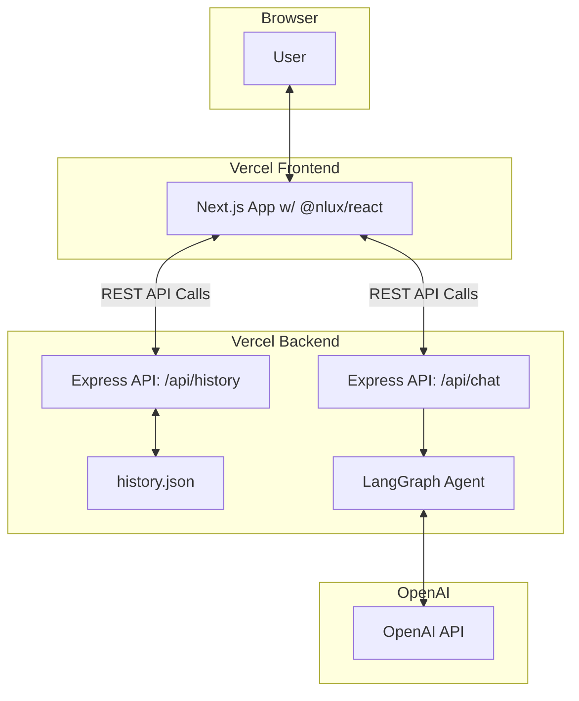

# CollectWise Fullstack Architecture Document (v1.1)

## 1. Introduction

This document outlines the complete fullstack architecture for the **CollectWise Chatbot**. It covers the separate **frontend** and **backend** applications, their integration, and the core AI logic, serving as the single source of truth for development.

- **Starter Template:** None. This is a greenfield project built from scratch following a polyrepo structure.
- **Change Log:**
  | Date | Version | Description | Author |
  | :--- | :--- | :--- | :--- |
  | Sep 25, 2025 | 1.0 | Initial architecture based on PRD v1.2 | Winston (Architect) |
  | Sep 25, 2025 | 1.1 | Added detailed testing strategy and Vercel compatibility notes. | Winston (Architect) |

---

## 2. High-Level Architecture

### Technical Summary

The solution is a **decoupled, polyrepo application** deployed entirely on **Vercel**. The **frontend** is a **Next.js** application using the `@nlux/react` library for the UI. The **backend** is a simple and scalable **Express.js** server. The two communicate via a REST API. The core negotiation logic is managed by a **LangGraph state machine** which uses **BAML** to structure calls to the **OpenAI API**. Chat history is persisted in a simple JSON file on the backend's file system.

### Platform and Infrastructure

- **Platform:** **Vercel**
- **Key Services:**
  - **Vercel Hosting:** For the Next.js frontend application (global CDN).
  - **Vercel Serverless Functions:** For hosting the backend Express.js API.
- **Repository Structure:** **Polyrepo** within a single GitHub repository to maintain clear separation between frontend and backend concerns.

### Architecture Diagram



### Architectural Patterns

- **Polyrepo**: Separates frontend and backend codebases for independent development and deployment.

- **Serverless**: Utilizes Vercel's serverless functions for the backend, ensuring scalability and low maintenance.

- **State Machine Agent**: Employs LangGraph to manage the complex, multi-state negotiation conversation, making the logic robust and easy to follow.

- **Component-Based UI**: Leverages React and the @nlux/react library for a modular and maintainable user interface.

---

## 3. Technology Stack

| Category           | Technology   | Version | Purpose                                        |
| ------------------ | ------------ | ------- | ---------------------------------------------- |
| Frontend Framework | Next.js      | ~14.2   | UI development and hosting.                    |
| UI Library         | @nlux/react  | ~0.4    | Pre-built, high-quality chat components.       |
| Styling            | Tailwind CSS | ~3.4    | Utility-first CSS for rapid styling.           |
| Backend Framework  | Express.js   | ~4.19   | Simple, robust, and fast for building the API. |
| Language           | TypeScript   | ~5.4    | Type safety across the stack.                  |
| AI State Machine   | LangGraph.js | latest  | Manages the conversational agent's state.      |
| AI Functions       | BAML         | latest  | Structures and validates LLM function calls.   |
| AI Service         | OpenAI API   | gpt-4o  | Powers the negotiation intelligence.           |
| Testing            | Jest         | ~29.7   | Unit testing for backend logic.                |
| Deployment         | Vercel       | N/A     | Hosting and CI/CD for both apps.               |

---

## 4. API Specification

### /api/history (Persistence)

- **GET /api/history**: Retrieves the current chat history from history.json.

- **POST /api/history**: Overwrites history.json with the provided conversation array.

- **DELETE /api/history**: Clears the contents of history.json.

**Note**: The history.json file serves as the single source of truth for a user's conversation history, ensuring state is maintained between interactions.

### /api/chat (AI Interaction)

- **POST /api/chat**:
  - **Request Body**: `{ messages: Message[] }`
  - **Response**: A streamed response of the AI's reply.

---

## 5. Unified Project Structure

The project will live in a single GitHub repository with the following structure:

```
collectwise-chatbot/
├── backend/
│   ├── data/
│   │   └── history.json        # Chat persistence
│   ├── src/
│   │   ├── agent/              # LangGraph and BAML setup
│   │   │   ├── graph.ts
│   │   │   └── functions.baml
│   │   ├── api/                # Express routes
│   │   │   ├── historyRoutes.ts
│   │   │   └── chatRoutes.ts
│   │   └── index.ts            # Express server entry point
│   ├── tests/
│   │   └── agent.test.ts
│   ├── package.json
│   ├── tsconfig.json
│   └── vercel.json             # Vercel deployment config for backend
│
├── frontend/
│   ├── src/
│   │   ├── app/
│   │   │   ├── page.tsx        # Main page component
│   │   │   └── layout.tsx
│   │   └── components/
│   │       └── ChatController.tsx  # Component managing state and API calls
│   ├── package.json
│   ├── tsconfig.json
│   ├── tailwind.config.ts
│   └── vercel.json             # Vercel deployment config for frontend
│
├── docs/
│   ├── prd.md
│   └── architecture.md
│
└── .gitignore
```

---

## 6. Testing Strategy

This strategy focuses on efficiently verifying the core negotiation logic and its outcomes.

### Backend Unit Tests (Jest)

We will use a table-driven testing approach in Jest to run multiple scenarios through the agent logic efficiently. This ensures the key user pathways and negotiation thresholds are validated.

**Example** (`backend/tests/agent.test.ts`):

```typescript
import { negotiationAgent } from "../src/agent/graph";

// Helper function to parse URL for testing
const parsePaymentUrl = (url) => {
  if (!url || !url.includes("?")) return null;
  const params = new URLSearchParams(url.split("?")[1]);
  return {
    termLength: parseInt(params.get("termLength"), 10),
    totalDebtAmount: parseInt(params.get("totalDebtAmount"), 10),
    termPaymentAmount: parseInt(params.get("termPaymentAmount"), 10),
  };
};

describe("Negotiation Agent Scenarios", () => {
  const testCases = [
    {
      name: "Case 1: The Payer (Accepts first offer)",
      conversation: [
        {
          role: "user",
          content: "I was laid off but I think I can do $800 a month.",
        },
      ],
      expectedTermLength: 3,
      expectedPaymentAmount: 800,
    },
    {
      name: "Case 2: The Negotiator (Settles on final offer)",
      conversation: [
        { role: "user", content: "I can’t afford that." },
        // Mock AI would offer $400/mo
        { role: "user", content: "That is still too much." },
        // Mock AI would offer $200/mo
        { role: "user", content: "Ok, $200 a month works." },
      ],
      expectedTermLength: 12,
      expectedPaymentAmount: 200,
    },
    {
      name: "Case 3: The Stonewaller (Offers unrealistic plan)",
      conversation: [{ role: "user", content: "I can pay $5 a month." }],
      expectNoUrl: true, // Expects the agent to end without a deal
    },
  ];

  test.each(testCases)(
    "$name",
    async ({
      conversation,
      expectedTermLength,
      expectedPaymentAmount,
      expectNoUrl,
    }) => {
      // Mock the AI responses based on the conversation flow
      const result = await negotiationAgent.invoke(conversation);
      const finalMessage = result.finalMessage;

      if (expectNoUrl) {
        expect(finalMessage).not.toContain(
          "[collectwise.com/payments](https://collectwise.com/payments)"
        );
      } else {
        const urlParams = parsePaymentUrl(finalMessage);

        // Test the final URL parameters
        expect(urlParams.totalDebtAmount).toBe(2400);
        expect(urlParams.termLength).toBe(expectedTermLength);
        expect(urlParams.termPaymentAmount).toBe(expectedPaymentAmount);

        // **Test the negotiation floor/threshold**
        expect(urlParams.termLength).toBeLessThanOrEqual(12);
        expect(urlParams.termPaymentAmount).toBeGreaterThanOrEqual(200);
      }
    }
  );
});
```

---

## 7. Development Workflow

### Local Setup

1. Clone the repository.

2. Run `npm install` inside both the frontend and backend directories.

3. Create a `.env` file in the backend directory and add your `OPENAI_API_KEY`.

4. To run both servers simultaneously, you can use two separate terminals or install concurrently:

```bash
npm install -g concurrently
concurrently "npm run dev --prefix frontend" "npm run dev --prefix backend"
```

---

## 8. Deployment Architecture

### Vercel Compatibility

This polyrepo architecture is fully compatible with Vercel and is a common pattern. To deploy, you will create two separate Vercel projects from your single GitHub repository:

### Frontend Project (collectwise-frontend)

- **Root Directory**: `frontend`
- **Framework Preset**: Next.js
- Vercel will automatically detect and build your Next.js application.

### Backend Project (collectwise-backend)

- **Root Directory**: `backend`
- **Framework Preset**: Other (or Express.js if available)

You will need a `vercel.json` file in the backend directory to tell Vercel how to handle the Express server as a serverless function:

**backend/vercel.json**:

```json
{
  "version": 2,
  "builds": [
    {
      "src": "./src/index.ts",
      "use": "@vercel/node"
    }
  ],
  "routes": [
    {
      "src": "/(.*)",
      "dest": "/src/index.ts"
    }
  ]
}
```

Your frontend application will then call the live URL of your deployed backend project by setting the appropriate environment variable. This is the fastest and simplest way to manage deployment for a 2-hour project.
