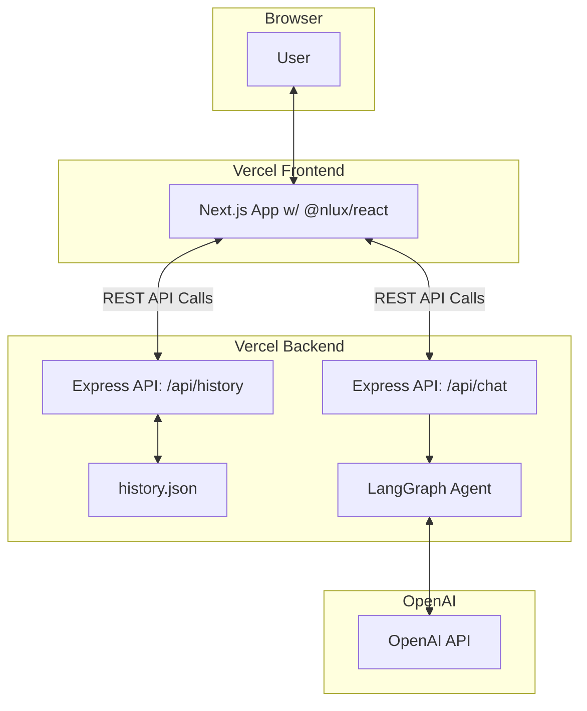

# 2. High-Level Architecture

### Technical Summary

The solution is a **decoupled, polyrepo application** deployed entirely on **Vercel**. The **frontend** is a **Next.js** application using the `@nlux/react` library for the UI. The **backend** is a simple and scalable **Express.js** server. The two communicate via a REST API. The core negotiation logic is managed by a **LangGraph state machine** which uses **BAML** to structure calls to the **OpenAI API**. Chat history is persisted in a simple JSON file on the backend's file system.

### Platform and Infrastructure

- **Platform:** **Vercel**
- **Key Services:**
  - **Vercel Hosting:** For the Next.js frontend application (global CDN).
  - **Vercel Serverless Functions:** For hosting the backend Express.js API.
- **Repository Structure:** **Polyrepo** within a single GitHub repository to maintain clear separation between frontend and backend concerns.

### Architecture Diagram

### Architectural Patterns

- **Polyrepo**: Separates frontend and backend codebases for independent development and deployment.

- **Serverless**: Utilizes Vercel's serverless functions for the backend, ensuring scalability and low maintenance.

- **State Machine Agent**: Employs LangGraph to manage the complex, multi-state negotiation conversation, making the logic robust and easy to follow.

- **Component-Based UI**: Leverages React and the @nlux/react library for a modular and maintainable user interface.

---

