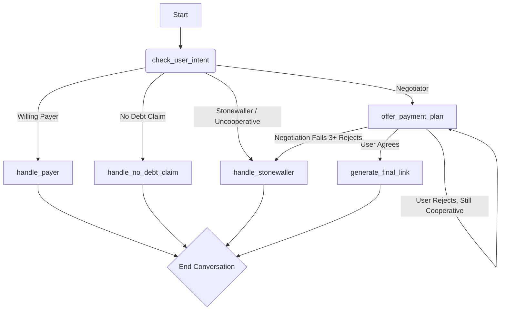

# LangGraph Agent Flow

The negotiation will be managed by a stateful agent built with LangGraph. The graph will consist of the following nodes (states) and edges (transitions).

### Node Descriptions

- **check_user_intent**: The entry point. It uses BAML to classify the user's initial response into one of the key pathways: Payer, Negotiator, "No Debt" Claim, or Stonewaller.

- **offer_payment_plan**: The core negotiation engine. It maintains the state of the negotiation (which offer has been made) and uses the Tiered Offer Strategy to prsopose a plan. It evaluates the user's response to decide whether to re-offer, accept an agreement, or escalate to the stonewaller state.

- **handle_payer**: A simple node that generates the full payment link and concludes the conversation.

- **handle_no_debt_claim**: This node handles users who deny the debt. It will politely provide a reference number and a contact phone number to resolve the discrepancy, then end the chat.

- **handle_stonewaller**: Engaged when a user is uncooperative or negotiation fails after 3 offers. It delivers a firm, final message with the most flexible payment plan available and a contact number, then ends the chat.

- **generate_final_link**: Once an agreement is reached in the offer_payment_plan node, this state formats the final URL and presents it to the user.

---

